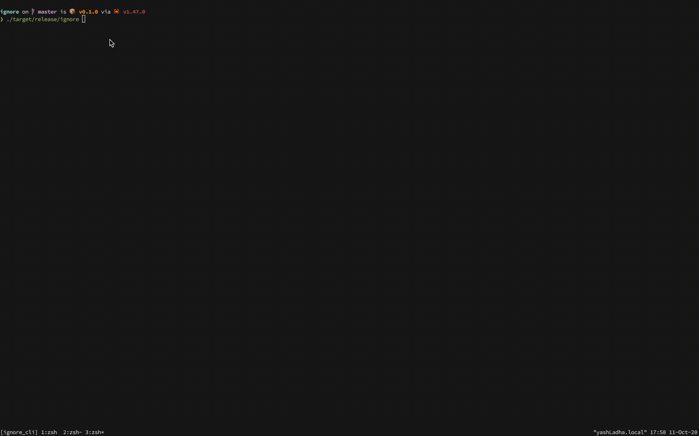

## ⚠ gnore

CLI port of the awesome [gitignore.io](https://gitignore.io) in rust because 😅 WHY NOT!!!!

This project is me trying 👷 to get familiarity with rustlang 🦀.

Things that you can do with the binary.
1. Fuzzy find the stack from CLI as you do on the Web, in interactive mode.
2. If want speed and directly want to capture the ignore from api, you can pass the list explicitly.
3. Automatically detects the `.git` directory and updates the `.gitignore` in that path only.

## 🛠 Build Instructions

__PS: Make sure you have rust installed on your system before proceeding with the
next steps.__

1. Clone the repository.
```sh
$ git clone --recurse-submodules https://github.com/yashLadha/ignore.git
```

2. `cd` into the directory and execute the following command.
```sh
$ cargo build --release
```

3. You can the generated binary at the following path
```sh
$ ./target/release/gnore
```

## 💻 Demo


